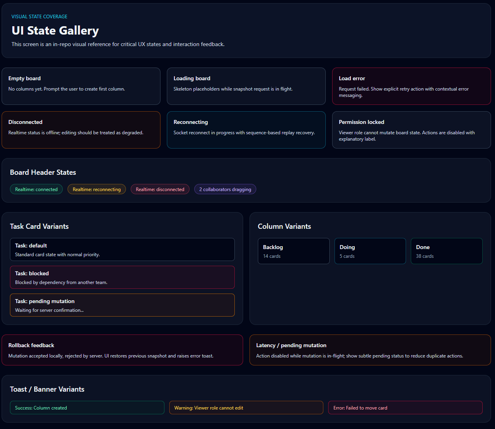
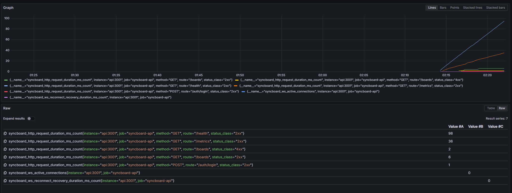

# SyncBoard

Realtime collaborative Kanban workspace with strict access control, resilient WebSocket sync, and production-oriented engineering workflow.

## Table of Contents

- [Overview](#overview)
- [Core Capabilities](#core-capabilities)
- [Architecture](#architecture)
- [Tech Stack](#tech-stack)
- [Quick Start (Local)](#quick-start-local)
- [Run with Docker](#run-with-docker)
- [Observability](#observability)
- [Testing and Quality Gates](#testing-and-quality-gates)
- [Performance Regression Gate](#performance-regression-gate)
- [Visual Regression Layer](#visual-regression-layer)
- [UI Screenshots](#ui-screenshots)
- [Engineering Docs](#engineering-docs)
- [Useful Scripts](#useful-scripts)

## Overview

SyncBoard is a full-stack monorepo focused on reliable realtime collaboration:

- API with typed contracts and ACL-aware authorization.
- Web client with optimistic updates and reconnect/resync handling.
- Production-grade observability with Prometheus + Grafana.
- CI gates for security, quality, performance, and end-to-end verification.

## Core Capabilities

- Secure auth for REST and WebSocket flows.
- Board membership ACL checks for all sensitive operations.
- Realtime event stream with reconnect replay (`fromSequence`).
- Negative-path test coverage for forbidden/unauthorized scenarios.
- Performance benchmarks with regression threshold checks.

## Architecture

```text
apps/
  api/        Fastify + Prisma + Redis/Postgres integrations
  web/        React + Vite + Playwright e2e
packages/
  shared/     Typed contracts and shared domain primitives
ops/
  observability/
    prometheus/  scrape config + alert rules
    grafana/     provisioned datasources + dashboards
docs/
  adr/ runbooks/ security/ testing/ deployment/ incident-response
```

## Tech Stack

- Backend: Fastify, Prisma, PostgreSQL, Redis, Zod
- Frontend: React 19, Vite, TanStack Query, Zustand, dnd-kit
- Testing: Vitest, Playwright
- Observability: Prometheus, Grafana
- Tooling: pnpm workspaces, TypeScript, ESLint

## Quick Start (Local)

Prerequisites:

- Node.js 20+
- pnpm 10+
- Docker (for infra services)

```bash
pnpm install
pnpm infra:up
pnpm --filter @syncboard/api db:generate
pnpm --filter @syncboard/api db:push
pnpm dev
```

Endpoints:

- Web: `http://localhost:5173`
- API: `http://localhost:3001`
- Health: `http://localhost:3001/health`
- Metrics: `http://localhost:3001/metrics`

To stop local infra:

```bash
pnpm infra:down
```

## Run with Docker

Standard app stack:

```bash
docker compose up --build
```

App + observability profile:

```bash
docker compose --profile observability up --build -d
```

Default ports:

- API: `3001`
- Web: `5173`
- PostgreSQL: `5432`
- Redis: `6379`
- Prometheus: `9090`
- Grafana: `3002`

## Observability

Built-in signals:

- `GET /health` for liveness.
- `GET /metrics` for Prometheus exposition.
- Structured logs with request correlation (`x-request-id` / `reqId`).

Key metrics:

- `syncboard_ws_active_connections`
- `syncboard_ws_reconnect_total`
- `syncboard_failed_mutations_total`
- `syncboard_forbidden_total`
- `syncboard_http_request_duration_ms`
- `syncboard_ws_reconnect_recovery_duration_ms`

Grafana dashboard is provisioned automatically:

- `SyncBoard Observability`

## Testing and Quality Gates

Local validation flow:

```bash
pnpm lint
pnpm typecheck
pnpm --filter @syncboard/shared test
pnpm --filter @syncboard/api test
pnpm --filter @syncboard/web test
pnpm --filter @syncboard/web test:e2e
```

CI pipeline includes:

- `security` (audit + license allowlist)
- `quality` (lint/typecheck/test/build)
- `performance` (bench + threshold gate)
- `e2e` (browser workflows + UI state checks)

## Performance Regression Gate

Run benchmark locally:

```bash
pnpm bench:api
```

Run CI-like benchmark gate:

```bash
pnpm performance:ci
```

Benchmarks are designed to detect regressions in core REST and WebSocket paths.

## Visual Regression Layer

UI state baselines are covered in Playwright tests under `apps/web/e2e`.

- Canonical state screen: `__ui-states`
- Goal: catch unexpected UI deltas in critical interaction states.

## UI Screenshots

### Product UI


### Visual Regression State Gallery



### Observability Dashboard



## Engineering Docs

- Security automation: [docs/security.md](docs/security.md)
- Observability guide: [docs/observability.md](docs/observability.md)
- SLO definitions: [docs/slo.md](docs/slo.md)
- Testing guide: [docs/testing.md](docs/testing.md)
- Deployment guide: [docs/deployment.md](docs/deployment.md)
- Incident response: [docs/incident-response.md](docs/incident-response.md)
- Runbooks index: [docs/runbooks/README.md](docs/runbooks/README.md)
- ADR index: [docs/adr/README.md](docs/adr/README.md)
- Performance notes: [docs/performance.md](docs/performance.md)

## Useful Scripts

```bash
pnpm dev                  # run api + web in parallel
pnpm dev:api              # api only
pnpm dev:web              # web only
pnpm dev:docker           # full app via docker compose
pnpm seed:demo            # seed sample data
pnpm security:ci          # audit + license checks
pnpm bench:api            # local benchmark
pnpm performance:ci       # benchmark + gate
pnpm obs:up               # start prometheus + grafana
pnpm obs:down             # stop prometheus + grafana
```
