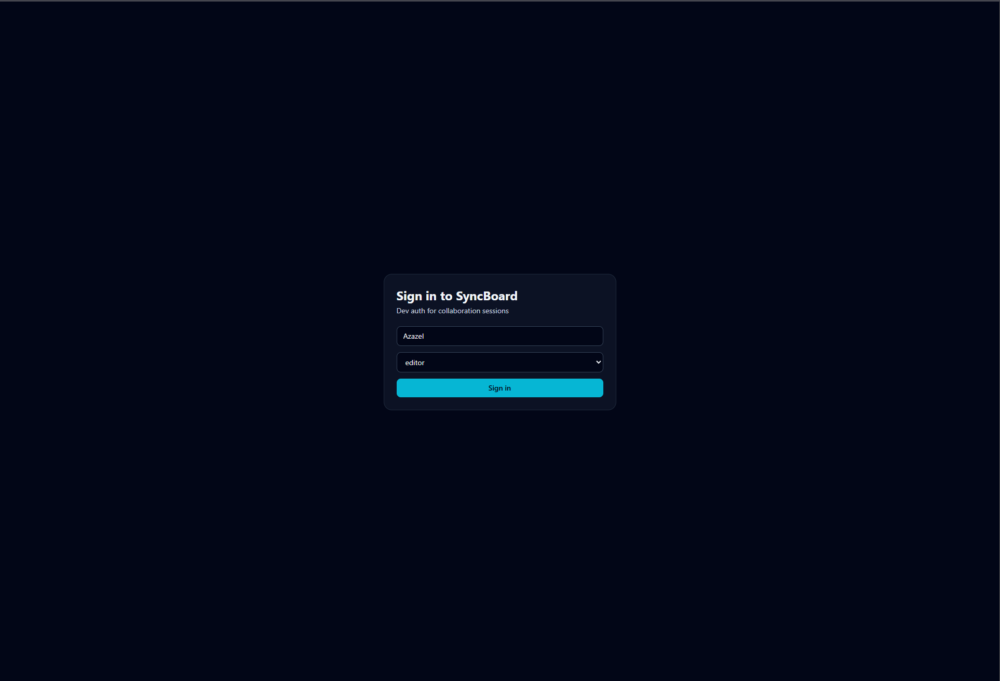
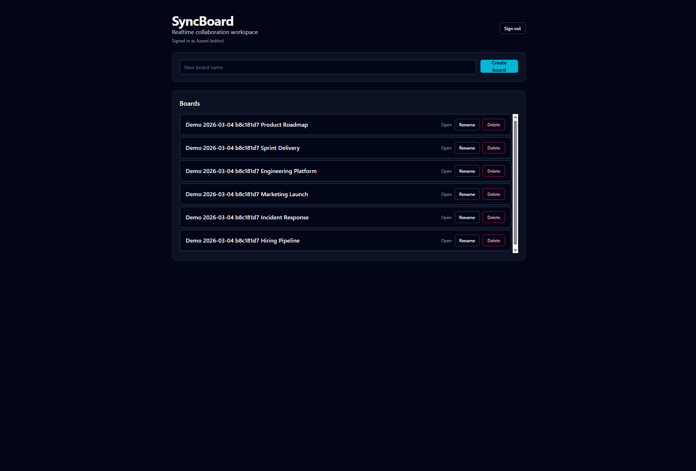
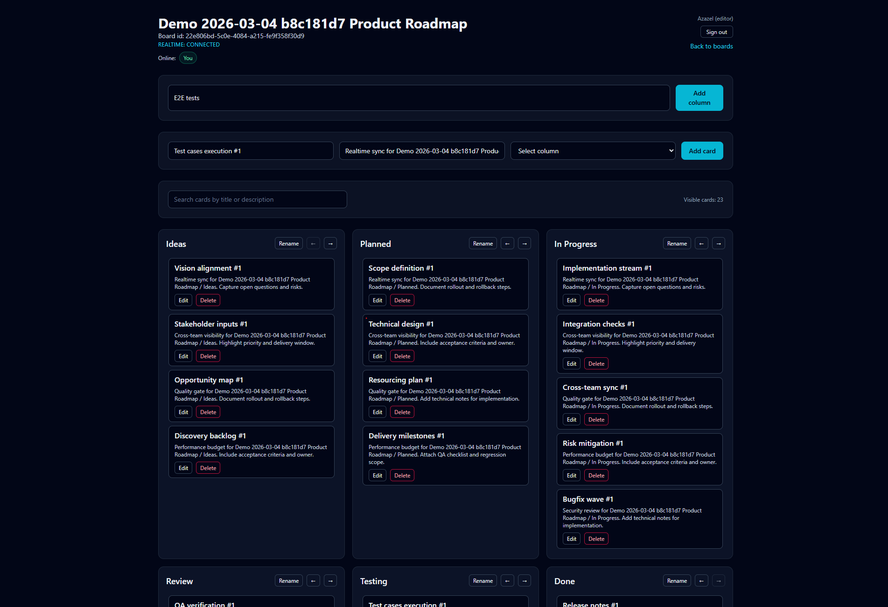
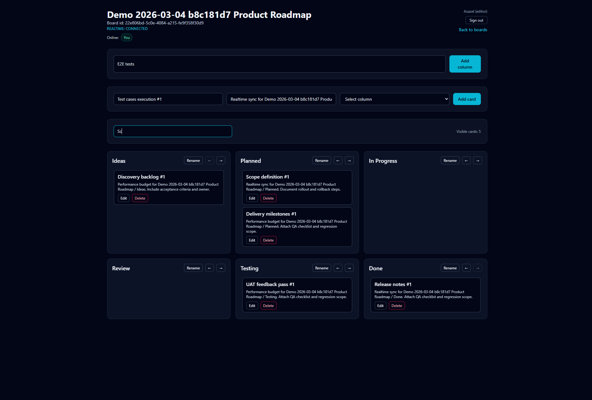
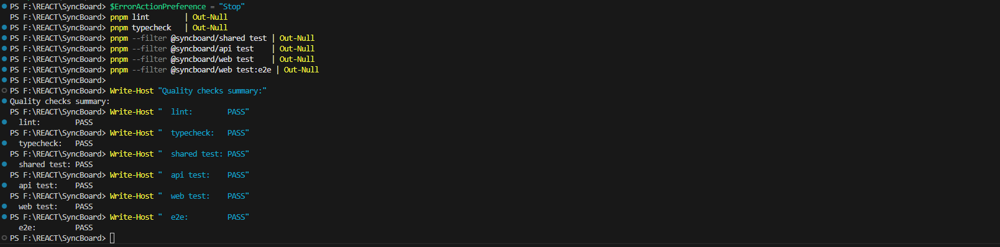
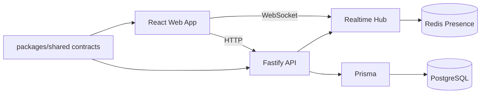

# SyncBoard

Realtime collaborative Kanban workspace with typed contracts, optimistic updates, live board sync, and role-aware access control.

## Highlights

- Realtime collaboration over WebSocket rooms per board.
- Presence tracking and ephemeral collaboration signals (`active drag`).
- Optimistic UI with rollback paths for failed mutations.
- Typed REST and WS contracts shared across frontend and backend.
- Drag and drop card movement with persistent ordering.
- Role-based permissions (`owner`, `editor`, `viewer`) enforced in UI and API.
- CI pipeline with lint, typecheck, unit/integration tests, and Playwright e2e.
- Demo seed script for generating rich board data for live previews.

## Why This Project

SyncBoard is a portfolio-grade realtime full-stack case focused on engineering reliability, not only feature completeness:

- explicit consistency behavior for stale/duplicate event handling
- reconnect recovery via `fromSequence` replay
- security-first API/WS access model (auth + membership ACL)
- observable runtime signals through `/health`, `/metrics`, and structured logs

## Product Tour

### Login


### Boards Overview


### Full Board View


### Search and Filter


### Realtime Sync


### Test Quality Snapshot


## Tech Stack

### Frontend

- React 19
- TypeScript
- Vite
- React Router
- TanStack Query
- Zustand
- React Hook Form + Zod
- DnD Kit
- TanStack Virtual
- Tailwind CSS
- Radix Slot + CVA based UI primitives

### Backend

- Fastify
- WebSocket (`@fastify/websocket`)
- TypeScript
- Prisma ORM
- PostgreSQL
- Redis (presence store)

### Monorepo and Tooling

- pnpm workspaces
- ESLint
- Vitest
- Playwright
- GitHub Actions CI
- Docker Compose

## Architecture



## Realtime Reliability

- Server emits monotonic per-board sequence envelopes.
- Client applies only strictly newer envelopes and drops stale/duplicate events.
- Reconnect path supports `board.join` with `fromSequence` and missed-event replay.
- Server remains source of truth; client reuses snapshot invalidation for safety.

## Observability

- `GET /health` for liveness checks.
- `GET /metrics` exposes Prometheus-style counters/gauges.
- `syncboard_ws_active_connections` tracks active WS connections.
- `syncboard_ws_reconnect_total` tracks reconnect count.
- `syncboard_failed_mutations_total` tracks failed mutation count.
- `syncboard_forbidden_total` tracks forbidden response count.
- `x-request-id` is attached to HTTP responses for request tracing.

## Security Model Summary

- REST routes require bearer auth.
- WS handshake requires token auth.
- Board access is protected by membership ACL checks.
- Write operations are blocked for `viewer` role.
- Role header spoofing is not trusted as authority.

## Monorepo Structure

```text
apps/
  api/        Fastify backend
  web/        React frontend
packages/
  shared/     Shared Zod schemas and contracts
docs/
  adr/        Architecture Decision Records
  performance.md
  screenshots/
```

## Quick Start

### Prerequisites

- Node.js 20+
- pnpm 10+
- Docker (optional, for containerized run)

### Local Development

```bash
pnpm install
pnpm dev
```

Local URLs:

- Web: `http://localhost:5173`
- API: `http://localhost:3001`
- WebSocket: `ws://localhost:3001/ws`

### Docker Development

```bash
pnpm dev:docker
```

This starts PostgreSQL, Redis, API, and Web.

## Environment

Core variables used by the apps:

- `VITE_API_URL`
- `VITE_WS_URL`
- `PORT`
- `HOST`
- `APP_ORIGIN`
- `PERSISTENCE_MODE`
- `DATABASE_URL`
- `REDIS_URL`

See `.env.example` for defaults and examples.

## Demo Seed Data

Generate a full demo workspace with multiple users, boards, columns, and cards:

```bash
pnpm seed:demo
```

Optional:

```bash
DEMO_LABEL="Release Board" pnpm seed:demo
```

The script prints created board IDs at the end for quick navigation.

## Quality and Testing

Run all quality checks:

```bash
pnpm lint
pnpm typecheck
pnpm --filter @syncboard/shared test
pnpm --filter @syncboard/api test
pnpm --filter @syncboard/web test
pnpm --filter @syncboard/web test:e2e
```

CI workflow is defined in `.github/workflows/ci.yml` and includes:

- Quality job: install, lint, typecheck, tests, build
- E2E job: Playwright browser install and e2e execution

## Test Strategy

Coverage is layered to catch regressions at different boundaries:

- unit tests for pure board/realtime/UI logic
- API integration tests for auth, ACL, mutation flows, and WS behavior
- e2e tests for critical user flows and cross-session realtime sync

Priority negative scenarios include unauthorized access, forbidden mutation, reconnect replay behavior, and stale event rejection.

## Performance Benchmark

Run local REST + WebSocket benchmark scenarios:

```bash
pnpm bench:api
```

Detailed benchmark guide:

- `docs/performance.md`

## Engineering Docs

- `docs/performance.md`
- `docs/adr/README.md`

## Known Trade-offs

- Realtime replay buffer is in-memory and bounded; long disconnects may require full snapshot refresh.
- Presence storage supports memory and Redis modes; behavior differs by deployment mode.
- The project prioritizes deterministic sequence-based convergence over advanced CRDT conflict resolution.

## Future Improvements

- Persist replay/event stream for longer offline recovery windows.
- Add visual-state coverage tooling (Storybook or equivalent) for UI state regression.
- Expand observability with dashboard presets and alert examples.

## Realtime Event Model

Key board events:

- `card.created`
- `card.updated`
- `card.moved`
- `card.deleted`
- `column.created`
- `column.updated`
- `presence.update`
- `activity.update`

Events include sequencing metadata, and the client ignores stale envelopes to keep board state consistent.

## Scripts

### Root

- `pnpm dev`
- `pnpm build`
- `pnpm lint`
- `pnpm typecheck`
- `pnpm seed:demo`
- `pnpm bench:api`
- `pnpm infra:up`
- `pnpm infra:down`
- `pnpm dev:docker`

### Web

- `pnpm --filter @syncboard/web dev`
- `pnpm --filter @syncboard/web test`
- `pnpm --filter @syncboard/web test:e2e`

### API

- `pnpm --filter @syncboard/api dev`
- `pnpm --filter @syncboard/api test`
- `pnpm --filter @syncboard/api seed:demo`
- `pnpm --filter @syncboard/api bench`
